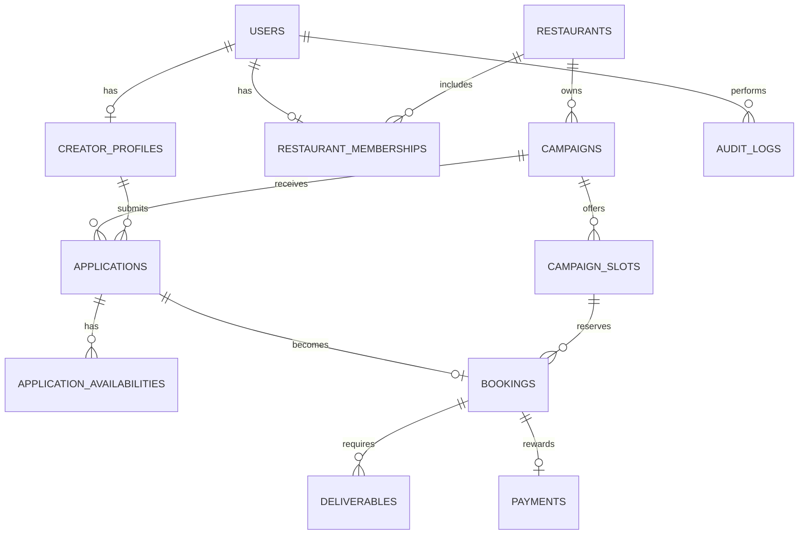

# Data Model v1

## Design goals

- 「日時候補」を文章ではなく構造化データとして扱う
- Campaign / Application / Booking / Deliverable / Payment を分離する
- 後からAI推薦・UGC・決済を追加しても破壊的変更を減らす
- 重要状態変更を監査できる

## Core entities

## Tables

### users
- id uuid PK
- email unique
- role enum: creator | restaurant | admin
- status enum: active | suspended | deleted
- created_at
- updated_at

### creator_profiles
- id uuid PK
- user_id FK unique
- display_name
- bio
- base_area
- min_reward integer
- travel_radius_km integer
- reliability_score nullable
- verified_at nullable
- created_at
- updated_at

### creator_social_accounts
- id
- creator_id
- platform enum
- handle
- profile_url
- followers
- avg_views nullable
- avg_saves nullable
- local_audience_ratio nullable
- metrics_verified_at nullable

### restaurants
- id
- name
- address
- area
- latitude nullable
- longitude nullable
- status
- verified_at nullable
- created_at

### restaurant_memberships
- id
- restaurant_id
- user_id
- role enum: owner | manager | staff

### campaigns
- id
- restaurant_id
- title
- description
- category
- area
- cash_reward integer
- reward_tax_mode enum: tax_included | tax_excluded | unspecified
- food_offer text
- max_companions integer
- creator_slots integer
- visit_period_start date
- visit_period_end date
- application_deadline timestamptz
- status
- published_at nullable
- created_at
- updated_at

### campaign_platforms
- id
- campaign_id
- platform
- deliverable_type
- quantity
- required boolean

### campaign_slots
- id
- campaign_id
- starts_at timestamptz
- ends_at timestamptz
- capacity integer
- reserved_count integer
- status enum: open | full | closed

Constraint:
- reserved_count <= capacity
- unique(campaign_id, starts_at)

### applications
- id
- campaign_id
- creator_id
- party_size
- status
- note nullable
- applied_at

Constraint:
- unique(campaign_id, creator_id)

### application_availabilities
Creatorの「候補日時」。

- id
- application_id
- kind enum: exact_slot | flexible_after
- campaign_slot_id nullable
- date_local date
- flexible_after_local time nullable

Rules:
- exact_slot の場合 campaign_slot_id 必須
- flexible_after の場合 date_local + flexible_after_local 必須

### bookings
- id
- application_id unique
- campaign_id
- creator_id
- campaign_slot_id
- party_size
- status
- confirmed_at
- visited_at nullable
- cancelled_at nullable

DB transactionで、
1. campaign_slotsをlock
2. capacity確認
3. reserved_count increment
4. booking create
を行う。

### deliverables
- id
- booking_id
- platform
- type
- due_at
- submitted_url nullable
- submitted_at nullable
- verification_status enum: pending | approved | rejected
- verification_note nullable

### payments
- id
- booking_id unique
- creator_id
- amount integer
- currency char(3) default JPY
- status enum: pending | approved | scheduled | paid | failed
- due_at nullable
- paid_at nullable
- external_reference nullable

### notifications
- id
- user_id
- type
- title
- body
- read_at nullable
- created_at

### audit_logs
- id
- actor_user_id nullable
- actor_role
- action
- entity_type
- entity_id
- before_json nullable
- after_json nullable
- created_at

## Status constraints

ステータス遷移はAPI層で明示的に制限する。
UIから任意のstatus文字列を直接更新させない。

## Indexes

- campaigns(status, area, visit_period_start)
- campaign_slots(campaign_id, starts_at, status)
- applications(campaign_id, status)
- applications(creator_id, status)
- bookings(creator_id, status)
- bookings(campaign_id, status)
- deliverables(due_at, verification_status)
- payments(status, due_at)

## Future extensions

- offers
- creator_rate_cards
- content_assets
- content_usage_rights
- tracking_links
- conversions
- disputes
- creator_metrics_daily
- restaurant_subscriptions
- payout_accounts
- flash_campaigns
